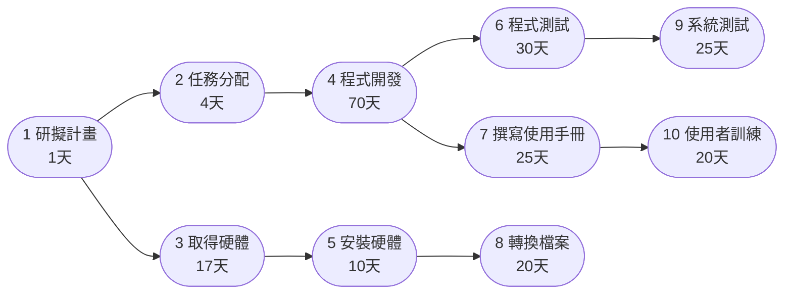
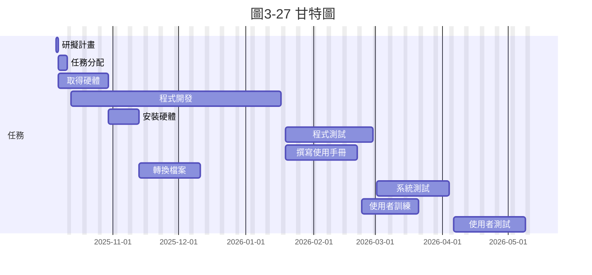

一、任務清單
| 任務ID | 任務說明   | 需時（天） | 前置任務 |
|:---:|:--------|:---:|:---:|
| 1 | 研擬計畫   | 1  | - |
| 2 | 任務分配   | 4  | 1 |
| 3 | 取得硬體   | 17 | 1 |
| 4 | 程式開發   | 70 | 2 |
| 5 | 安裝硬體   | 10 | 3 |
| 6 | 程式測試   | 30 | 4 |
| 7 | 撰寫使用手冊 | 25 | 4 |
| 8 | 轉換檔案   | 20 | 5 |
| 9 | 系統測試   | 25 | 6 |
| 10 | 使用者訓練 | 20 | 7, 8 |
| 11 | 使用者測試 | 25 | 9, 10 |

二、(1) PERT / CPM 依存關係圖

三、(2) 甘特圖（專案起始：2025-10-06）

四、(3) 關鍵路徑分析
前推 / 後推計算摘要

關鍵路徑：1 → 2 → 4 → 6 → 9 → 11

總工期：155 天
8 --> 10
9 --> 11([11 使用者測試\n25天])
10 --> 11

