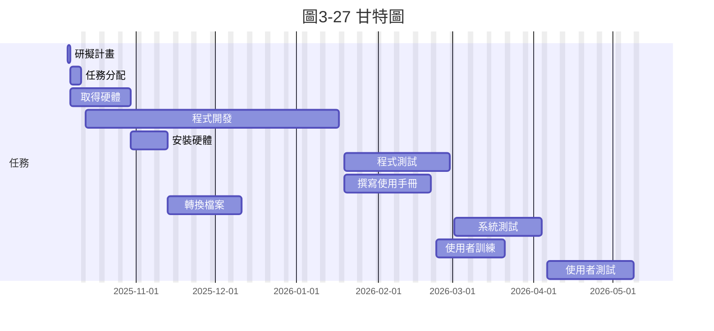

一、任務清單
任務ID	任務說明	需時（天）	前置任務
1	研擬計畫	1	-
2	任務分配	4	1
3	取得硬體	17	1
4	程式開發	70	2
5	安裝硬體	10	3
6	程式測試	30	4
7	撰寫使用手冊	25	4
8	轉換檔案	20	5
9	系統測試	25	6
10	使用者訓練	20	7, 8
11	使用者測試	25	9, 10

二、(1) PERT / CPM 依存關係圖
flowchart LR
1([1 研擬計畫\n1天]) --> 2([2 任務分配\n4天])
1 --> 3([3 取得硬體\n17天])
2 --> 4([4 程式開發\n70天])
3 --> 5([5 安裝硬體\n10天])
4 --> 6([6 程式測試\n30天])
4 --> 7([7 撰寫使用手冊\n25天])
5 --> 8([8 轉換檔案\n20天])
6 --> 9([9 系統測試\n25天])
7 --> 10([10 使用者訓練\n20天])

三、(2) 甘特圖（專案起始：2025-10-06）

四、(3) 關鍵路徑分析
前推 / 後推計算摘要

關鍵路徑：1 → 2 → 4 → 6 → 9 → 11

總工期：155 天
8 --> 10
9 --> 11([11 使用者測試\n25天])
10 --> 11

五、CPM 計算表
任務	工期	前置	ES	EF	LS	LF	Slack
1	1	-	0	1	0	1	0
2	4	1	1	5	1	5	0
3	17	1	1	18	128	145	127
4	70	2	5	75	5	75	0
5	10	3	18	28	145	155	127
6	30	4	75	105	75	105	0
7	25	4	75	100	105	130	30
8	20	5	28	48	155	175	127
9	25	6	105	130	105	130	0
10	20	7,8	100	120	175	195	75
11	25	9,10	130	155	130	155	0
